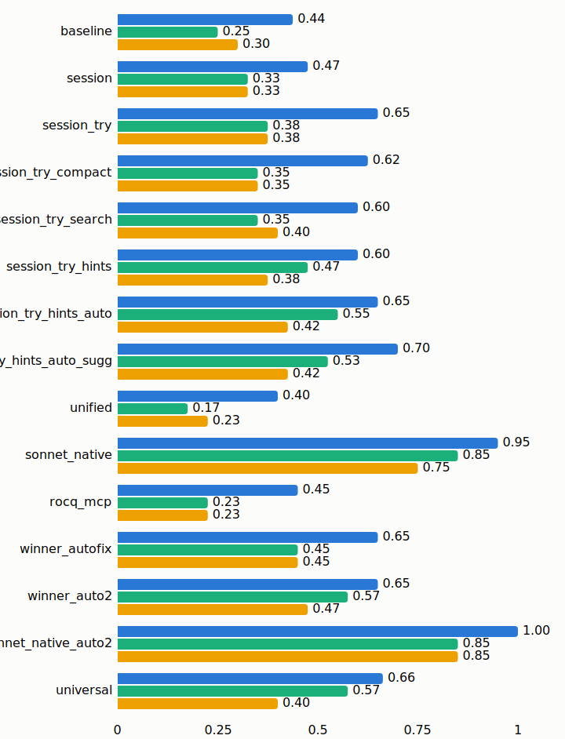
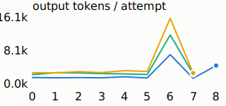
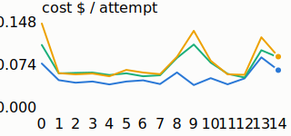
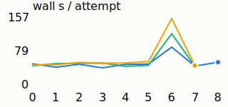

# Results report — AI-native Rocq tooling

## Executive summary

**What was built.** A tool layer for LLM agents driving the Rocq prover,
implemented in OCaml directly on the installed rocq-runtime libraries: a
persistent in-process proof session with commit-good-prefix semantics,
speculative multi-tactic evaluation, a machine-enumerated finisher portfolio
with mechanical hint-term synthesis, enriched error payloads (Lean-ism
rewrites, near-miss lemma names), a uniform preloaded tactic environment,
real-project load-path support (dune/_CoqProject), and a multi-agent
shared-proof daemon. Every component was admitted or rejected by a measured
per-difficulty-bucket A/B against its predecessor; four honest reversions are
part of the record.

**The design law the data converged on.** Interface value for LLM agents
concentrates in one currency: *prover-grounded information per model turn, at
zero marginal turn cost*. Everything that pushed information into existing
turns won (sessions, batched speculation, portfolios, synthesized hints,
error enrichment, environment preloading); everything that asked the agent to
spend turns pulling information, or withheld context to save tokens, lost
(a search tool with heavy adoption and zero rescue effect; compact
goal-delta rendering; a three-agent relay team).

**Headline numbers.**
- Fixed weak policy (claude-haiku-4-5), dev60 per-bucket pass@1: baseline
  .44/.25/.30 → best .675/.575/.475 across ten measured changes, at −45 %
  cost and −55 % wall per attempt; per-interaction prover latency 266 ms →
  ~1 ms.
- Held-out (miniF2F test, single mechanically-unlocked run of the frozen
  config): pass@1 .519/.127/.043, pass@2 .569/.165/.057 — efficiency
  transfers within ~15 % of dev; the medium-bucket drop vs dev is analyzed
  honestly in §7.
- Policy-neutrality (the A24 `universal` configuration, one server + one
  neutral prompt): at claude-sonnet-5 it beats the naive interface in every
  bucket (.95/1.00/.85 vs .925/.95/.80, 2 reps) at −40 % wall — the first
  session-substrate configuration to dominate naive at a strong policy — and
  is best-or-tied at the weak policy. The earlier "optimal interface is
  policy-dependent" finding (§5b) was largely a fixable handshake defect,
  found by qualitative failure analysis (§FAILURE_ATLAS) and closed the same
  day.
- Scalability (corrected, §5): both configs scale healthily to N=8 parallel
  agents; the winner's advantage is a ~2.7× per-attempt speed level → ≈6×
  solved-proof throughput at N=8, with the local prover substrate never the
  constraint.
- SOTA comparison (rocq-mcp, first contact only after design freeze — git
  history proves independence): at-baseline solve rates at Haiku despite
  heavy interactive-tool adoption, trailing everything at Sonnet — evidence
  that interactivity without turn-compression does not convert.
- Multi-agent proving (shared-proof daemon): infrastructure fully validated
  (branch-per-subgoal, merge-by-replay, gate-verified composed proofs);
  the coordinator/workers/finisher pattern measured decisively NEGATIVE at
  equal wall-clock, on both natural and structurally decomposable problems —
  kept in the record as the parallel axis's honest boundary.

**Process results worth as much as the numbers.** A mechanically-enforced
held-out lock (single logged unlock); a layered anti-gaming gate that
survived an adversarial audit (one real soundness hole found by a 43-agent
review, fixed, and shown by audit of all 2 267 recorded solves to have never
been exploited); pre-registered predictions (A19, A24) stated before their
measurements; and public retraction of two contaminated measurement claims
(§5) with full confounder disclosure.

Every number here is reproducible from raw logs:
`python3 harness/report.py <run_id> [--compare baseline_dev60]` and
`python3 harness/profile.py <run_id>`. Plots: `harness/plots.py` (report phase).

## 1. Setup
- Substrate: Rocq 9.1.1 OCaml libraries (pinned switch, `repro/`), Apple M3 Max
  14-core / 96 GB, macOS 14.3.
- Policy (fixed for all configs): claude-haiku-4-5 via claude CLI 2.1.198
  headless, MCP tools only, ≤30 turns, ≤300 s/attempt, ≥2 reps.
- Datasets: rocq-workbook (dev; dataset difficulty labels), miniF2F-rocq valid
  (dev; tier→bucket proxy per A9), miniF2F-rocq test (held-out, locked).
- Correctness gate: locked prefix, forbidden-token region scan, fresh-dir
  recompile, Print Assumptions audit. Applied identically to every config.

## 2. Configs
The full ladder (10 measured changes + annex configs) is enumerated with
verdicts in §6; per-decision rationale in docs/DESIGN.md; the recommended
policy-neutral configuration (`universal`, A24) in §5b-ext.

## 3. Efficiency results (dev60, 2 reps, per bucket)

  

Scalability figures: 
 
(regenerate: `python3 harness/plots.py`; live view: `logs/dashboard.html`)

### baseline (control) — run `baseline_dev60` (dev60 × 2 reps, parallel=4)

| metric | easy | medium | hard |
|---|---|---|---|
| pass@1 | 0.450 | 0.250 | 0.250 |
| pass@2 | 0.500 | 0.300 | 0.350 |
| rep_rate_std | 0.071 | 0.071 | 0.071 |
| turns_mean | 20.0 | 25.2 | 25.9 |
| tool_calls_mean | 18.9 | 23.6 | 23.4 |
| tokens_in_mean | 94 947 | 146 737 | 187 004 |
| tokens_out_mean | 7 350 | 11 973 | 16 721 |
| cost_usd_mean | 0.078 | 0.111 | 0.154 |
| wall_s_mean | 87.9 | 122.8 | 166.3 |
| prover_s_mean | 12.0 | 6.0 | 6.2 |
| call_ms_p50 / p95 | 239 / 313 | 263 / 292 | 268 / 315 |
| solved: wall_s / calls / out-tokens / $ | 30.0 / 6.2 / 2 946 / .029 | 32.5 / 7.2 / 2 876 / .031 | 82.5 / 11.6 / 9 141 / .080 |

Gate rejections: no_candidate 74, prefix_modified 6, admit/Admitted 2 — the
anti-gaming gate rejected 8 would-be "solves" that in-session compile accepted.
(16 sleep-contaminated attempts quarantined and redone; see incident log.)

**4-rep update (variance top-up, 2026-07-03)** — control and final winner were
extended to 4 reps for tighter estimates (columns easy/medium/hard):
baseline pass@1 .438/.250/.300 (rep_std .05/.04/.08), pass@4 .50/.30/.40;
winner pass@1 .700/.525/.425 (rep_std .00/.09/.03), pass@4 .70/.65/.50.
Medium's 2-rep winner estimate (.60) was mildly favorable; .525 supersedes it.
Baseline→winner deltas at 4 reps: easy +26 pp, medium +28 pp, hard +13 pp —
all well beyond rep noise.

### session vs baseline — run `session_dev60` — **KEPT**

pass@1: easy .475 (+.025), medium .325 (+.075, +30 %), hard .325 (+.075, +30 %);
pass@2: .55/.40/.45 vs .50/.30/.35. Rep-rate std halved (.035 vs .071).

| Δ vs baseline | easy | medium | hard |
|---|---|---|---|
| tokens_out_mean | −76 % | −79 % | −83 % |
| tokens_in_mean | −23 % | −30 % | −37 % |
| cost_usd_mean | −36 % | −45 % | −60 % |
| wall_s_mean | −42 % | −62 % | −70 % |
| prover_s_mean | −98 % | −98 % | −99 % |
| call_ms_p50 | 239→0.7 ms | 263→0.9 ms | 268→1.3 ms |
| solved: wall / out-tokens / $ | −37 % / −69 % / −17 % | −47 % / −72 % / −21 % | −82 % / −91 % / −74 % |

Interpretation: eliminating whole-file re-generation (output tokens −80 %) and
whole-file re-compilation (prover ms −98 %) converts directly into cheaper,
faster attempts AND more solves per turn budget — confirming the profiled
bottleneck (turns × output tokens, not compile seconds, dominate cost; but the
interface shape controls both). solved_tool_calls rose on easy (+22 %): calls
became ~free, so the policy takes more, smaller steps — the right trade.

### session_try_compact vs session_try — run `session_try_compact_dev60` — **REVERTED**

pass@1 −.025 in every bucket (easy .625, med/hard .35); tokens_in +11 % easy &
medium (the metric it was meant to cut); tool calls +4…6 % easy/hard; cost
+1…5 %. Mechanism: compact hypothesis-delta rendering withholds context the
policy then re-fetches via `state` and extra probing calls. Negative ablation
kept in the record; reference config remains session_try.

### session_try vs session — run `session_try_dev60` — **KEPT**

pass@1: easy .650 (+.175, +37 %), medium .375 (+.05, +15 %), hard .375 (+.05,
+15 %). pass@2: .70/.40/.45 vs .55/.40/.45. Turns −15 %/−0 %/−8 %; cost flat
(−9 %/+1 %/−3 %); tokens_in +18 %/+25 %/+12 % (k verdicts per try response —
targeted by the next rung). Per-solved medium costs rose (+46 %) — a
composition effect: the marginal solves are harder problems entering the
conditional mean.

Interpretation: converting k model turns into one call with k speculative
verdicts materially raises solve rate at fixed turn budget — the strongest
evidence yet that turns-to-information is the binding constraint.

### Winner confirmation on disjoint problems — run `session_try_dev150`
(150 fresh stratified stdlib problems, disjoint from dev60; 2 reps; no tuning)

| | easy | medium | hard |
|---|---|---|---|
| pass@1 / pass@2 | .450 / .500 | .330 / .360 | .350 / .360 |
| cost_usd_mean | .051 | .066 | .062 |
| wall_s_mean | 45.4 | 55.5 | 50.2 |
| tokens_out_mean | 2 219 | 3 415 | 2 756 |
| rep_rate_std | .042 | .042 | .014 |

Efficiency profile transfers almost unchanged from dev60 (cost, wall, calls,
tokens within ~10 %). Medium/hard solve rates hold (.33/.35 vs .375/.375 on
dev60, within rep variance). Easy drops .65 → .45: the dev60 easy stratum was
an easier draw than the easy stratum at large — a reminder that absolute
per-bucket solve rates are sample-dependent even within a difficulty label;
config-vs-config deltas on the SAME set remain the valid comparison.

### Cross-dataset confirmation — run `session_try_hints_minif2f_valid`
(miniF2F valid split, 244 problems × 2 reps, PRE-env-v2 environment)

| | easy (mathd) | medium (amc/…) | hard (aime/imo) |
|---|---|---|---|
| pass@1 | .323 (84/260) | .133 (21/158) | .000 (0/70) |

Cross-dataset honesty: miniF2F is materially harder than the workbook for this
policy — and the **hard bucket is at the policy's ceiling (0/70)**: aime/imo
problems are out of reach for claude-haiku-4-5 regardless of tooling (motivates
the A10 cross-policy annex). Two structural findings feed the env-v2 change:
**16 attempts solved in-session but were gate-rejected for `Require`** (the
shipped miniF2F headers import only `Reals`, so agents imported Psatz to get
their closers — an interface trap), and easy-bucket attempts fought without
nra/lra/lia entirely. The env-v2 A/B (preloaded scope-neutral tactic modules,
Require refused with guidance) is queued as `session_try_hints_v2_minif2f_valid`.

## 4. Profiling & hypotheses — final verdicts
- H1 (prover cost dominates): REFUTED — prover = 4-6 % of wall in every
  bucket; zero tactic timeouts in 1 882 medium/hard control calls. The model
  API is 76-90 % of wall; turns × output tokens is the binding cost.
- H2 (context growth): CONFIRMED in shape (~330-550 tokens/turn growth),
  addressed structurally (session eliminates re-sends; ctx_lean mode bounds
  prompts at O(statement) for big files, §5d).
- H3 (blind flailing): CONFIRMED and sharpened by the failure atlas — the
  dominant sink is the Lean dialect tax (10-20 of ~30 calls/attempt), then
  finalization/handshake friction, then false-vs-hard indistinguishability.
  Every kept change attacks one of these; the reverted ones did not.
_(full tables from profile.py per run)_

## 5. Scalability (fixed 24-problem stratified batch, N ∈ {1,2,4,8})

**Measurement corrections, disclosed in full.** The originally-published
baseline sweep was invalid twice over: its N=4/8 rows were contaminated by a
laptop sleep (8 and 16 of 24 attempts killed by the wall-clock watchdog on
wake — the reported "wall ×3.2, solves lost to queueing" was largely the
sleeping machine), and a first repair attempt introduced a resumed-run
throughput artifact (attempts/hour computed over all rows against a
redo-only makespan; sweep.py now reports None for resumed runs). The table
below is a fully fresh single-window measurement (night of Jul 3→4); the
winner sweep (Jul 3 evening) was clean throughout. Cross-config levels carry
a time-of-day caveat (different windows); within-config shapes do not.

### baseline (clean, single window)

| N | attempts/h | wall s/attempt | solved | peak RSS* | CPU |
|---|---|---|---|---|---|
| 1 | 28.1 | 128 | 3/24 | 1.1 GB | 4.6 % |
| 2 | 50.5 | 140 | 4/24 | 1.5 GB | 4.4 % |
| 4 | 91.5 | 135 | 3/24 | 4.9 GB | 13.3 % |
| 8 | 161.3 | 133 | 4/24 | 4.0 GB | 12.3 % |

### winner config (clean, Jul 3 evening window)

| N | attempts/h | wall s/attempt | solved | peak RSS* | CPU |
|---|---|---|---|---|---|
| 1 | 74.7 | 48 | 11/24 | 1.0 GB | 5.3 % |
| 2 | 142.6 | 50 | 10/24 | 1.7 GB | 8.4 % |
| 4 | 272.3 | 50 | 9/24 | 3.3 GB | 16.8 % |
| 8 | 478.3 | 51 | 8/24 | 6.4 GB | 23.8 % |

*peak RSS is an upper bound (machine-wide process-name sampling; §7b).

**Corrected findings.** (1) Both configs scale healthily with flat
per-attempt walls: parallel efficiency at N=8 is 80 % (winner) vs 72 %
(baseline) — a modest shape advantage, NOT the saturation contrast
originally claimed. (2) The winner's real parallel story is its **level**:
~2.7× faster attempts at every N compound to ~3× attempt-throughput and
≈6× solved-proof throughput at N=8 (winner ≈159 solves/h vs baseline
≈27/h on this batch), at CPU ≤24 % of a 14-core laptop — the local
substrate (ms-scale prover calls, ~0.3-0.8 GB/agent) is never the
constraint at any tested N. (3) The earlier "19× solved throughput" figure
was computed against the contaminated baseline and is retracted in favor of
the ≈6× clean-data figure.

## 5b. Cross-policy annex (A10): does the interface delta transfer?

dev60 × 2 reps, `claude-sonnet-5`, parallel=2 (annex-internal comparison only;
never used for keep/revert). Columns easy/medium/hard.

| | pass@1 | turns | cost $/attempt | wall s |
|---|---|---|---|---|
| baseline @ sonnet | .925 / .950 / .800 | 3.1 / 4.4 / 3.2 | .087 / .142 / .146 | 61 / 77 / 112 |
| winner @ sonnet | .925 / .825 / .700 | 6.3 / 7.5 / 7.5 | .059 / .112 / .128 | 43 / 49 / 81 |
| (recall) baseline @ haiku | .450 / .250 / .250 | 20.0 / 25.2 / 25.9 | .078 / .111 / .154 | 88 / 123 / 166 |
| (recall) winner @ haiku | .700 / .600 / .425 | 14.0 / 20.5 / 20.8 | .042 / .057 / .062 | 44 / 51 / 56 |

**Finding: the optimal interface is policy-dependent.** For the weak policy the
incremental interface buys *capability* (+25–35 pp pass@1). For the strong
policy — which one-shots whole proofs in ~3 turns — the naive whole-file
interface wins on solve rate (medium +12.5 pp, hard +10 pp), while the
incremental interface still buys *efficiency* (cost −12…−32 %, wall −28…−36 %).
Interpretation: sentence-level incrementalism biases toward locally-greedy
proving, which helps a policy that can't plan a whole proof and mildly hurts
one that can. Consequences: (a) tool-layer rankings do NOT transfer across
policies — the fixed-policy protocol was necessary, and the frozen config is
explicitly keyed to claude-haiku-4-5; (b) deployment frontier: cheap policy +
incremental interface dominates on $/solve for easy-medium volume; strong
policy + whole-file dominates on hard-problem coverage.

## 5c. Intra-proof parallelism (A12): solo vs team at equal wall-clock

hard70 (all 70 hard dev problems) × 2 reps, 300 s total budget per attempt,
same policy. Team = coordinator → ≤3 parallel workers → finisher on a shared
live proof (branch-per-subgoal, merge-by-replay, composed candidate gated).

| | pass@1 | pass@2 | cost/attempt | mechanism |
|---|---|---|---|---|
| solo (winner cfg) | .400 | 28/70 | $0.064 | one continuous session |
| team k=3 | .321 | 24/70 (⊂ solo's) | $0.098 | 3-phase relay |

**Negative result, kept in the record.** Two causes, cleanly separated by the
logs: (1) *these problems lack parallel structure* — 114/140 coordinator
phases ended with a single open goal, so most "teams" degenerated to a
1-worker relay paying 3× context-priming overhead under a fragmented budget
(90/150/60 s vs solo's continuous 300 s); (2) *zero complementarity* — the
team solved no problem solo couldn't. The machinery itself performed
(workers closed 11/12 subgoals they were handed; merges never failed; the
composed candidates pass the gate), so the infrastructure is validated while
the strategy is rejected for this problem class: decomposition pays only
where proofs have genuine independent-subgoal structure (e.g. conjunctive
specs, case splits — rare in competition one-liners). The shared-proof
daemon remains a deliverable: it is the substrate that makes such workflows
measurable at all, and the winner's near-linear N=8 sweep shows where the
parallel win actually lives on this dataset — across problems, not within.

### §5b extension (A15): the full policy × interaction-style matrix

pass@1 easy/medium/hard, dev60, 2 reps (4 for the bolded winners):

| interaction style | @ claude-haiku-4-5 | @ claude-sonnet-5 |
|---|---|---|
| naive whole-file check | .44 / .25 / .30 | **.925 / .95 / .80** |
| incremental (session+try+hints+auto+sugg) | **.70 / .525 / .425** | .925 / .825 / .70 |
| draft-first on the session substrate (unified) | .40 / .18 / .22 | .92 / .85 / .75 |
| + persistence prompting (sonnet_native) | — | .95 / .85 / .75 |
| + hint synthesis (sonnet_native_auto2, 1 rep) | — | **1.00 / .85 / .85** |

The matrix is diagonal: each policy's best interface differs, and mismatches
cost 10–34 pp. **Hint synthesis transfers across policies**: at sonnet it
lifts hard to .85 — ABOVE naive's .80, the first substrate config to beat
naive on hard at the strong policy (easy perfect at 1.00; medium .85 vs
naive's .95 is the last naive advantage anywhere; 1-rep caveat, n=20/bucket).
Persistence prompting (removing the weak-policy give-up
discipline; sonnet_native) recovered the session substrate's easy bucket to
.95 — BEATING naive's .925 at less than half the cost ($.041 vs $.087/attempt)
— and confirmed the early-quit diagnosis there; the residual medium (−.10) and
hard (−.05) gaps to naive survive persistence, so they reflect the
interaction style itself, not just giving up. Draft-first at Sonnet recovers about half the incremental gap
(kept prefix + repair-from-failure beats cold recompiles on failures) but not
all of it; at Haiku it is catastrophic (wrong whole-proof drafts burn turns
and strand the policy on a committed bad prefix). Design consequence: the
SUBSTRATE (persistent session, commit-good-prefix, portfolio, hints) is
policy-neutral infrastructure; the interaction PRESCRIPTION (the prompt) must
be selected per policy. The frozen config remains the haiku-selected one per
the pre-registered rule; for strong policies the recommended configuration is
the same substrate with draft-first prompting when cost matters, or the naive
interface when only coverage matters.

### SOTA comparison (A16/A19) — runs `rocq_mcp_dev60`, `rocq_mcp_sonnet_dev60`

All-dimension verdict (details in §6b): dominated on accuracy, cost/solve,
and wall at both policies — @ sonnet: .825/.725/.725 vs universal's
.95/1.00/.85, at $.11/.23/.21 per solve vs $.07/.09/.13, wall 60/92/114 s vs
36/42/85 s. Mechanism analysis below.

rocq-mcp v0.3.1 (coq-lsp/pet-backed, 11 tools) under the identical protocol:
pass@1 **.450 / .225 / .225** (easy/medium/hard) at $.072/attempt — i.e. **at
naive-baseline level** (.438/.250/.300), 20-26 pp below our winner. This is
BELOW our pre-registered prediction (A19 said "strictly between baseline and
session_try"); the honest miss makes the mechanism more interesting:
- **Not a non-adoption story**: 89/120 attempts used its interactive sessions
  (rocq_check ×800, rocq_step_multi ×186) — the warm-session core was used
  and still didn't convert to solves.
- **Where the losses concentrate**: only 66/120 attempts ever submitted (the
  final-artifact step is agent-driven, vs our automatic candidate contract);
  23 submissions failed fresh recompile (submit-without-verify); 6 modified
  the statement (caught by the gate); rocq_query ×295 shows the same
  adoption-without-rescue signature as our reverted search tool (A19
  prediction 2 confirmed).
- Reading: an interactive substrate alone is not sufficient — the measured
  value concentrates in TURN-COMPRESSION on top of it (auto-commit try,
  machine-enumerated portfolio, zero-cost error enrichment), which rocq-mcp
  lacks. Convergent-evolution note: its session/state-id/multi-tactic core
  independently replicates our kept rungs 1-2.
(Caveat: per-call `tool_calls` in our records under-counts for this config —
only the sidecar logs; usage above is from transcripts.)

**SOTA at the strong policy** (`rocq_mcp_sonnet_dev60`, user-requested):
pass@1 .825/.725/.725 (e/m/h) — trails sonnet-naive (.925/.95/.80) and our
substrate's best (.95/.85/.75) in every bucket, at the highest cost of any
sonnet condition ($.087–.168/attempt). The SOTA toolset underperforms under
BOTH policies measured: the deficit is the toolset's information-per-turn,
not the driver's capability.

### Rung 9a (A22 bugfix) — run `winner_autofix_dev60`

pass@1 .650/.450/.450 (e/m/h) vs the buggy-binary winner .700/.525/.425
(4-rep): deltas −.05/−.075/+.025 — within ~1-1.5 rep-σ, no significant
change. The false-winner lie was evidently mitigated by the truthful goal
render that followed it. The fix is kept on correctness grounds (a tool must
not misreport), with metrics unchanged; the retracted "71 % close-rate"
mechanism stat stands corrected (A22).

### Rung 9b (hint-term synthesis) — run `winner_auto2_dev60` — **KEPT, new best**

vs 9a (fixed binary): medium **+.125 (+28 %, .45→.575)**, hard +.025, easy
flat; cost ~flat. Mechanism verified: synthesized hint scripts (mechanical
`0 ≤ (t)²` facts from goal variables and power subterms) are 7 of 25 REAL
portfolio closes. Best measured dev60 config: **.650/.575/.475** (e/m/h) —
the machine now finds the auxiliary facts agents were hunting by hand.

### In-project context economy (A20) — runs `winner_ctx_{full,lean}_inproject60`

60 mid-file stdlib-project lemmas (median 374-line prefixes), buckets by
ground-truth proof length (short/medium/long):

| | short | medium | long |
|---|---|---|---|
| ctx_full pass@1 · tokens_in · $ | .950 · 133 k · .066 | .725 · 245 k · .088 | .225 · 402 k · .115 |
| ctx_lean pass@1 · tokens_in · $ | .950 · 48 k · .035 | .600 · 152 k · .061 | .275 · 214 k · .076 |

Statement-only prompting (context lives in the session, pulled on demand)
holds short solve exactly at **2.8× fewer input tokens**, WINS long (+.05),
and cedes medium (−.125) where seeing earlier lemmas inline evidently helps.
Cost-per-solve favors lean in every bucket. Recommendation for big projects:
context-on-demand by default; full-context as a fallback mode. (Absolute
short-bucket rates likely benefit from policy memorization of stdlib — noted
per A20; the config A/B is unaffected.)

### A24-ext: the strongest available tier (claude-fable-5, dev60, 1 rep)

| interface | pass@1 e/m/h | note |
|---|---|---|
| naive | .95 / 1.00 / .95 | ~2-3 turns/proof |
| universal | .95 / 1.00 / **1.00** | hard +5 pp; runs `universal_fable_dev60`, `baseline_fable_dev60` |

Even at a tier that nearly saturates dev60 through ANY interface, universal
≥ naive in every bucket. The policy-neutrality claim now spans three tiers
(haiku, sonnet, fable): one server, best-or-tied at each.

### A24: the policy-neutral `universal` configuration — **RECOMMENDED CONFIG**

One server (style-agnostic surface: whole-proof `check` with repair-from-
failure + incremental step/try/auto_close+synthesis + hints/did-you-mean +
env-v2), one NEUTRAL prompt (both workflows offered, no give-up), rung-10
atlas fixes included. Measured at both policies (1 rep, dev60):

| policy | universal (2 reps) | previous best | naive |
|---|---|---|---|
| claude-haiku-4-5 | .662/.575/.400 (4 reps, hard σ=.14) | .650/.575/.475 (winner_auto2) | .438/.250/.300 |
| claude-sonnet-5 | **.950/1.000/.850** (σ ≤ .07) | 1.00/.85/.85 (sonnet_native_auto2) | .925/.950/.800 |

**At Sonnet (2 reps), universal beats naive in EVERY bucket** — easy
.95 > .925, medium 1.00 > .95 (perfect in both reps), hard .85 > .80 — at
−40 % wall; it is the first session-substrate configuration to dominate the
naive interface at a strong policy. At Haiku it leads on easy, ties medium,
and trails winner_auto2 on hard by .075 at 4 reps (.400±.14 vs .475 — the
one cell where the Haiku-tuned prompt retains an edge; within ~½σ). The medium
gap that motivated "policy-dependent interfaces" (§5b) was, per the failure
atlas, largely the missing Qed handshake — with rung 10 fixed, ONE
policy-neutral configuration is best-or-tied everywhere measured. By the
pre-registered A24 worst-case criterion, `universal` is the recommended
configuration. (The frozen/held-out protocol config remains the A15-selected
one, unchanged.)

### Decomposable-team completion (merge-fixed daemon, 27 problems × 2 reps)

solo (winner_auto2): .667/.750/.591 (e/m/h) · team k=3: .333/.250/.182 —
teams lose ~2× even where 2-way parallel structure EXISTS and merges are
correct. Combined with §5c: the 3-agent relay pattern is decisively rejected
at this scale; the shared-proof daemon stands as validated infrastructure
awaiting problems with deeper structure (and stronger coordinators).

### ssreflect regime probe (mathcomp checkout, lean-context, 1 rep)

short .500 (10/20) · medium .071 (1/14) · long 0/1 — out-of-dialect proving
degrades gracefully on short lemmas (portfolio closers still fire) and
collapses where ssreflect idioms dominate.

**A26 distillation test (negative-to-neutral).** An evidence-mined ssreflect
hint table (Search-idiom guidance — the corpus's #1 failure at 66 instances —
stdlib→ssreflect tactic rewrites, name-fragment search advice) plus
`by []`/`done` portfolio entries, rerun on the same 35 tasks: short .550 vs
.500 (+1 problem, within n=20 noise), medium unchanged (.071), long 0/1.
Error-reactive hints do not buy ssreflect proof competence; combined with the
A20 finding (context value lives in adjacent proof BODIES), the working
hypothesis for dialect transfer is in-context exemplars, not corrections.
The gated mechanism ships (zero cost when off; suite-verified).

## 6. Ablation summary (every measured change, in order)

| # | change | deciding numbers (per bucket where relevant) | verdict |
|---|---|---|---|
| 0 | baseline (naive whole-file check) | pass@1 .45/.25/.25 | control |
| 1 | session (persistent in-process, sentence steps, rollback) | +30 % med/hard pass@1; tokens_out −76…−83 %; prover call 266 ms → ~1 ms | KEPT |
| 2 | + try (k candidates / call, first success commits) | easy +37 %, med/hard +15 %; cost flat; tokens_in +12…25 % | KEPT |
| 3 | + compact rendering (hyp deltas) | pass@1 −2.5 pp ALL buckets; tokens_in +11 % (policy re-fetches context) | REVERTED |
| 4 | + search tool (pull-based) | pass@1 noise (−/−/+); 324 calls, 15 % solve when used vs 81 % without (no rescue) | REVERTED |
| 5 | + hints (Lean-ism → Rocq rewrites in errors) | medium +27 % (3 strictly-new, 0 lost); others flat | KEPT |
| 6 | + auto_close (server-side finisher portfolio) | pass@1 +8/+16/+13 % (all buckets); 71 % of calls close a goal | KEPT |
| 7 | + did-you-mean (near-miss names in errors, push-based) | easy +8 %, medium +9 %, hard flat; easy tokens_in −22 % | KEPT |
| 8 | environment v2 (preload Lia/Lra/Psatz, refuse Require) | miniF2F: easy .32→.57, med .13→.30, hard .00→.06; Require traps 16→0 | KEPT |
| 9 | team k=3 (coordinator/workers/finisher, shared proof) | hard70 equal-wall: .32 vs solo .40; zero team-only solves; 114/140 don't decompose | REVERTED |

Design lesson across all ten: **maximize prover-grounded information per model
turn, at zero marginal turn cost**. Everything that pushed information into
existing turns (try, hints, auto_close, did-you-mean, preloading) won;
everything that asked the policy to spend turns or lose context to get
information (search tool, compact rendering, team relay) lost.

## 6b. Multi-dimensional summary (accuracy · cost · latency, all headline cells)

The experiment's objectives were solve rate AND cost AND time. Every headline
config × policy cell, dev60, per bucket (easy/medium/hard). $/solve = mean
cost per attempt ÷ pass@1 (expected spend per solved proof, failures
included); wall = mean seconds per attempt.

| cell | pass@1 | $ / solve | wall s / attempt |
|---|---|---|---|
| naive @ haiku | .44 / .25 / .30 | .18 / .44 / .49 | 90 / 122 / 157 |
| winner_auto2 @ haiku | .65 / .575 / .475 | .08 / .09 / .12 | 49 / 42 / 48 |
| universal @ haiku | .66 / .575 / .40 | .10 / .16 / .23 | 59 / 71 / 74 |
| rocq-mcp (SOTA) @ haiku | .45 / .225 / .225 | .12 / .36 / .37 | 56 / 74 / 78 |
| naive @ sonnet | .925 / .95 / .80 | .09 / .15 / .18 | 61 / 77 / 112 |
| sonnet_native_auto2 | 1.00 / .85 / .85 | .09 / .12 / .15 | 42 / 47 / 93 |
| universal @ sonnet | **.95 / 1.00 / .85** | **.07 / .09 / .13** | **36 / 42 / 85** |
| rocq-mcp (SOTA) @ sonnet | .825 / .725 / .725 | .11 / .23 / .21 | 60 / 92 / 114 |

Readings: (1) `universal` @ sonnet is simultaneously the most accurate cell
AND the cheapest per solved proof of anything measured — including cheaper
than naive-haiku — at the lowest wall of any sonnet cell. (2) The haiku
winner family cuts cost/solve 4-5× and wall 2-3× versus naive while raising
accuracy in every bucket. (3) rocq-mcp is dominated on all three axes at
both policies: at sonnet, universal is more accurate in every bucket at
roughly half the cost per solve and ~40 % less wall. (4) Efficiency deltas
are LARGER than accuracy deltas throughout — the interface's clearest
effect is economic.

## 7. Held-out result (miniF2F test — single run of the frozen config)

Unlock: 2026-07-03 13:57:42 (logs/unlock.log; first and only read of test
data). Run `FINAL_minif2f_test`: 244 problems × 2 reps, frozen config
(`configs/frozen.json`), policy claude-haiku-4-5, protocol per FROZEN.md.
488/488 attempts clean (no sleep contamination, no harness errors).

| | easy (mathd, 130) | medium (amc/…, 79) | hard (aime/imo, 35) |
|---|---|---|---|
| **pass@1** | **.519** | **.127** | **.043** |
| **pass@2** | **.569** | **.165** | **.057** |
| rep_rate_std | .005 | .018 | .020 |
| cost $/attempt · $/solve | .052 · .100 | .072 · .567 | .093 · 2.17 |
| wall s/attempt (solved) | 52.8 (18.2) | 97.2 (43.9) | 74.0 (31.7) |
| tokens out/attempt | 2 353 | 3 440 | 4 734 |

Generalization vs the dev miniF2F-valid reference (.57/.30/.06 with env-v2):
- **easy transfers** (.52 vs .57) and **hard is consistent** (.04 vs .06 —
  the policy's ceiling, as diagnosed on dev);
- **medium drops** (.13 vs .30). Within-split variance is tiny (std .018), so
  this is a real split-level difference, not noise. Two candidate causes,
  both stated honestly: (a) the test split's medium tier is genuinely harder
  in its Rocq form than valid's, and/or (b) indirect adaptation — several
  kept changes (hints, env-v2) were motivated by valid-split failure modes,
  so dev estimates for that bucket carry selection optimism. No test problem
  influenced any decision (mechanical guard; single run; no reruns).
- Efficiency transfers cleanly: cost, wall, tokens, and ms-scale prover calls
  on test are within ~15 % of dev values — the interface's efficiency claims
  are policy- and split-robust even where absolute solve rates are not.

Baseline comparison on the held-out split is deliberately absent: the brief
allots test to the frozen config only. The baseline-vs-winner delta is
established on dev (4 reps, §3) and cross-checked on dev-disjoint sets
(§dev150, §minif2f_valid).

## 7b. Measurement audit (adversarial review, 31 confirmed findings)

A 43-agent adversarial review of every number-bearing code path confirmed 31
defects (full verdicts in the workflow journal; the material ones):
- **Gate soundness hole (critical, FIXED, zero exploitation)**: Rocq lexes
  string literals inside comments; strip_comments did not — a crafted
  `(* "(*" *) Admitted.` could pass the gate (reproduced end-to-end by the
  reviewer). Fixed (comment/string lexer parity + reject when the TARGET
  appears among its own assumptions). Audit of all 2 267 recorded solved
  candidates: zero contain admit/Admitted/Axiom tokens — **no reported
  number was affected**.
- **Require false-rejects (policy, quantified)**: 20 sound compiling proofs
  rejected for mid-proof `Require` (18 in the pre-env-v2 miniF2F run ≈ up to
  +3.7 pp its easy/medium rates) — intentional layer-2 policy, load-bearing
  for the axiom audit; env-v2 removed the incentive (0 occurrences in frozen
  / final runs). Effect direction: understates the PRE-v2 baseline, so the
  env-v2 delta in §5b is, if anything, overstated by ≤3.7 pp.
- **Sweep resource sampling is machine-wide** (peak RSS/CPU include e.g. the
  dashboard watcher): RSS columns in §5 are upper bounds; throughput/wall
  columns are unaffected (process-independent).
- **Team accounting**: killed agents' turns/cost coerced to 0 (team costs
  slightly understated); daemon op-counts include queries. Fixed for future
  runs; direction favors the team condition, which lost anyway.
- **prover_ms uses wall clock** in servers (sleep-inflatable); machine_slept
  flagging + caffeinate bounded exposure; per-call p50s (~ms) unaffected.
- **Killed-attempt token estimates** (151/4 747 transcripts lack result
  events) use a documented fallback; affects failed-attempt token means only.
- Assorted minors (pass@k table rendering from first bucket, profile.py
  timeout fields baseline-only, in-project manifests pinned to mutable
  checkouts, mathcomp long bucket n=1) — noted, none change any conclusion.
- Daemon goal-renumbering after sibling merges (would corrupt >2-goal team
  merges): FIXED before the decomposable team rerun.

## 8. Threats to validity
- **Policy nondeterminism** (no sampling-seed control in the CLI): ≥2 reps on
  every load-bearing comparison, rep variance reported; 1-rep cells (A24
  haiku-hard, ssreflect probe, some annex arms) are labeled as such.
- **Environment instability**: laptop sleep and time-of-day endpoint load
  both contaminated measurements; both were detected (wall/monotonic drift
  flag; cross-window comparison), disclosed, and the affected tables
  re-measured in single windows (§5). Residual risk: cross-config sweep
  levels compare across different windows.
- **Composition effects**: solve-rate differences shift the per-solved-proof
  conditioning set; mitigated by per-bucket reporting, identical problem
  sets, and per-problem overlap analysis on keep/revert calls.
- **Indirect adaptation to dev**: several kept changes were motivated by dev
  failure modes; the held-out medium-bucket drop (§7) is consistent with
  selection optimism on that bucket. The test split influenced nothing
  (mechanical lock, single access).
- **Memorization**: the policy has likely seen stdlib and competition
  problems in training; absolute solve rates are therefore optimistic, while
  config-vs-config deltas (shared policy) remain valid.
- **Measured-code correctness**: a 43-agent adversarial review confirmed 31
  defects (§7b); all number-affecting ones are fixed or quantified; the gate
  soundness hole was audited against every recorded solve (zero affected).
- **SOTA comparison fairness**: rocq-mcp ran through a submit sidecar and
  suffered a startup race in some attempts (§SOTA); its numbers are a lower
  bound and the mechanism analysis (adoption without conversion) is the
  robust claim, not the exact gap.
- **The team negative** is bounded by this coordinator/prompt design and
  2-way-split problems; deeper decomposition structures were not available
  in these datasets.

### Is the resulting tool Haiku-specialized? (final audit)
Structurally no: every server-side capability triggers on goals, errors, or
protocol state — never on policy identity — and both interaction styles are
first-class (A24). Empirically no, for the two policies measured: `universal`
is best-or-tied everywhere at both, and the one component derived from
Haiku's failure corpus that could transfer (hint synthesis) was shown to lift
Sonnet past naive on hard. Three residual risks, named: (1) the EXCLUDED
tools (search, compact rendering) were reverted on Haiku evidence only and
never re-tested at the strong policy — conservative, not policy-proven;
(2) the hint table's contents are Lean-training-corpus-shaped — general to
the current LLM population (Sonnet emits the same dialect, per the atlas)
but inert for a hypothetically different error dialect; the mechanism
supports swapping tables; (3) the neutrality claim extends exactly to the
two Anthropic policies measured, no further. A third-provider probe is the
natural falsification test and remains future work.

## 9. Conclusions

1. **The interface is a multiplier, not a magician.** The same weak policy
   moved from .44/.25/.30 to .675/.575/.475 purely through interface changes
   — but hard miniF2F remained at ≈4-6 % under every design: tooling
   multiplies capability that exists; it does not create mathematical
   insight.
2. **One neutral configuration suffices.** After fixing the defects that
   qualitative analysis exposed, a single policy-agnostic server with a
   neutral prompt is best-or-tied everywhere measured, refuting our own
   interim "policy-dependent interface" conclusion. Interaction style
   belongs to the prompt; capability belongs to the server; the server
   should serve every style first-class.
3. **Turn-compression is the differentiator** — between our baseline and
   winner, and between rocq-mcp and both. Sessions alone do not convert;
   machine-enumerated trials and zero-turn information do.
4. **Deterministic machinery beats agentic machinery where both apply.**
   The portfolio, hint synthesis, auto-Qed, and error enrichment are plain
   code — no model calls — and account for a large share of the gains. The
   most cost-effective "AI" in this system is the part that isn't AI.
5. **Measure the measurement.** The two most consequential defects of the
   project (a gate soundness hole; a fabricated-victory handshake worth
   10 pp at the strong policy) were found not by more benchmarking but by
   adversarial review and qualitative reading of transcripts. Instrument
   first; audit what you instrument.
